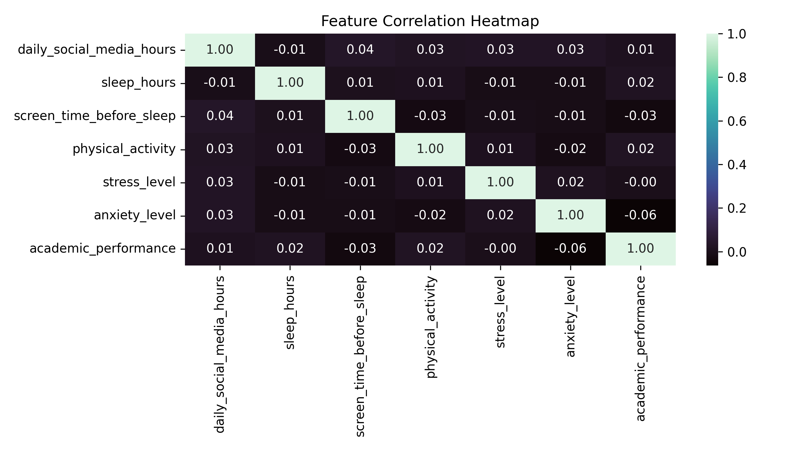

🩺 Adolescent Digital Health & Behavioral Diagnostics Suite

📌 Executive Summary
An end-to-end clinical and behavioral telemetry analytics project evaluating 1,200 adolescent subjects (ages 13–19). The pipeline ingests multi-dimensional behavioral data, performs statistical hypothesis testing and feature engineering in Python, executes advanced cohort queries via SQL, and visualizes clinical risk stratifications across a tailored 4-Page Power BI Suite styled in Deep Space Dark Navy (`#0A0E1A`).

 📊 4-Page Power BI Executive Suite

Page 1: Youth Digital Health & Behavioral Diagnostics (Overview)
- Population Baseline:Monitored 1,200 adolescents with a 4.5h daily average screen exposure and 6.4h restorative sleep baseline[cite: 2].
- Clinical Deficit Flag:40.0% (480 adolescents) operate under severe clinical sleep debt (<6.0 hours restorative sleep)[cite: 2].
- Adoption Benchmark:Cross-platform adoption metrics tracking Instagram, TikTok, and dual-platform usage[cite: 2].

  

Page 2: Psychological & Clinical Impact Matrix
- Diagnostic Matrix:** Multi-variable pivot stratifying `Avg Stress`, `Avg Sleep`, and `Daily Screen Hours` across gender and age cohorts[cite: 3].
- Platform Stress Parity:** Demonstrated uniform stress severity across TikTok (5.3) and Instagram (5.5)[cite: 3].

  

---

 Page 3: Clinical Stratification & Intervention Targets
- Risk Volume Treemap:** Platform adoption concentration benchmarking clinical intervention targets[cite: 4].
- Exposure Severity:** Cohort-level severity brackets confirming Early Teens (13–14) exhibit high stress vulnerability (5.77/10)[cite: 4].
- Circadian Balance:** Restorative sleep distribution benchmarks across gender[cite: 4].

  

Page 4: Patient Cohort Deep-Dive & Clinical Audit
- Granular Audit Grid:** Record-level clinical evaluation identifying at-risk subgroups by platform and age bracket[cite: 5].
- Sleep Deficit Burden:** Mid-Teens (15–17) represent the primary burden volume with 196 cases in severe sleep debt[cite: 5].
- Platform Stress Variance:** Clustered variance diagnostics assessing platform and gender deltas[cite: 5].

  

🔬 Exploratory Data Analysis & Statistical Testing (Python)
- Feature Engineering: Developed composite `digital_risk_score` (weighted screen time, pre-sleep exposure, and addiction indices), `sleep_debt_flag` (<6.0 hours restorative sleep), and stratified developmental cohorts[cite: 6].
- **Outlier Detection (IQR Method): Verified 0 outliers across screen exposure, sleep hours, and academic GPA metrics[cite: 6].
- Hypothesis Testing (Two-Sample T-Test): 
  - Hypothesis: Adolescents under circadian sleep deficit exhibit heightened stress severity[cite: 6].
  - Findings: Deprived cohort stress ($\mu = 5.50$) vs. Normal sleep ($\mu = 5.41$) yielded $T = 0.4870$ ($p = 0.626$), indicating cross-cohort systemic stress uniformity[cite: 6].
- Feature Correlation Heatmap:

  

🗄️ Relational Database Queries & Advanced SQL
Utilized SQLite with window functions and common table expressions (CTEs)[cite: 6]:
1. Quartile Exposure Segmentation: Partitioned exposure via `NTILE(4) OVER (ORDER BY daily_social_media_hours DESC)` isolating the top 25% exposure cohort (Early Teens stress peaking at 6.32)[cite: 6].
2. Platform Stress Parity: Quantified uniform stress levels across Instagram (5.50), TikTok (5.29), and dual-platform usage (5.55)[cite: 6].
3. Multi-Variable Matrix Pivot: Dynamically pivoted stress variance across platform categories and age groups using conditional aggregation[cite: 6].

💻 Tech Stack & Deliverables
- **Data Engineering & Statistics:** Python (`pandas`, `numpy`, `scipy`), Google Colab (`Healthcare_Social_Impact_Focus_Project.ipynb`)[cite: 12]
- **Relational Database:** SQLite (`teen_mental_health_cleaned.csv`)[cite: 12]
- **Business Intelligence:** Microsoft Power BI Desktop (`SOCIAL IMPACT.pbix`), DAX[cite: 12]
- **Telemetry UI/UX:** Custom Deep Space Dark Navy Canvas (`#0A0E1A`)
